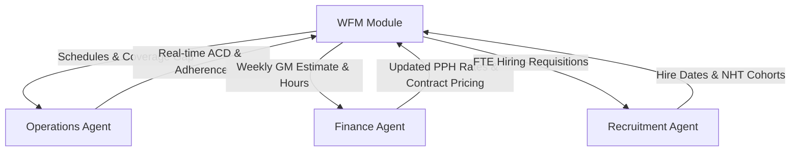

# Architecture Specification — AI Enterprise Operations WFM Platform

This document describes the architectural layout, pipeline processing steps, design guidelines, and cross-department interfaces for the Workforce Management (WFM) and Finance Integration system.

---

## 1. Architectural Overview

The application utilizes a **hybrid dual-runtime architecture**:
1. **Frontend Client (JavaFX 17+)**: A desktop application that renders the user interface. It manages windows, user input, dashboard visualization, and handles the lifecycle of the local backend server.
2. **Backend Server (FastAPI / Python 3.14)**: A stateless microservice launched dynamically by the JavaFX runtime. It encapsulates the core business logic, Erlang algorithms, status aggregation, and the deterministic Finance Billing Engine.

```
┌──────────────────────────────────────────────────────────────┐
│                      JAVAFX FRONTEND                         │
│   (Controllers, UI Components, SSE Reader, API Client)       │
└──────────────────────────────────────────────────────────────┘
           │                                 ▲
           │ HTTP POST/GET (JSON)            │ Server-Sent Events
           ▼                                 │ (SSE Ingest Progress)
┌──────────────────────────────────────────────────────────────┐
│                       FASTAPI BACKEND                        │
│   (Routers, Ingest Aggregator, Billing Engine, SQLite DB)    │
└──────────────────────────────────────────────────────────────┘
```

### 1.1 Local Lifecycle Management
- At startup, the JavaFX class `FastApiServer` invokes the embedded Python executable (`backend/python/python.exe`) using a Java `ProcessBuilder`.
- It appends console output to `fastapi.log` and waits for the `/health` endpoint to return a `200 OK` status (up to 8 seconds timeout) before loading the primary FXML scene.
- At shutdown, the JavaFX process destroys the Python process gracefully.

---

## 2. Deterministic Billing Pipeline: The 7-Step Chain

The **Billing Engine** (`services/billing_engine.py`) is written as a pure function. It accepts fully-hydrated inputs (`HourlyInputs`, `AgentRateInputs`, `LeaveResolution`) and produces a deterministic output (`BillingResult`).

```
[Hourly Inputs] ──► [Leave Resolution] ──► [Rate Cards] ──► [Billing Engine] ──► [Accrual] ──► [Provenance & Hash]
```

### 2.1 The Seven Mathematical Steps

1. **Step 1: Classify Worked Hours**
   - Categorizes raw minutes into pay-buckets: regular, overtime (OT), night premium, and holiday.
   - Enforces OT rules (approved `overtime_minutes` vs unapproved worked minutes).
   - Segregates hours falling into the night premium window (default: 22:00 to 06:00).

2. **Step 2: Resolve Leave Consumption**
   - Handled by `leave_service.resolve` before rate computation.
   - Applies the agent's contractual policy:
     - **BLOCK**: Rejects the absence if there is insufficient balance. Returns `409 Conflict`.
     - **UNPAID_AUTO**: Automatically records absence as Leave Without Pay (LWP) at a zero rate.
     - **MANAGER_APPROVAL**: Queues daily record as `PENDING_APPROVAL`, preventing monthly finalization.

3. **Step 3: Apply Rate Multipliers**
   - Applies base rates to categorized hours.
   - Accrues OT multiplier (e.g., $1.5\times$ base) and holiday multiplier (e.g., $2.0\times$ base).
   - Implements non-stacking rules by default (holiday rate overrides OT multiplier unless explicitly configured).

4. **Step 4: Sum and Accrue**
   - Computes daily gross:
     $$\text{Daily Gross} = \text{Regular Pay} + \text{OT Pay} + \text{Holiday Pay} + \text{Night Premium} + \text{Leave Pay}$$

5. **Step 5: Roll Up to Monthly Window**
   - Rolls up all daily gross records from day 1 to $N$ of the current month.
   - Projects end-of-month gross based on average daily performance and remaining days.

6. **Step 6: Apply Min/Max Pay Floors**
   - Evaluates the gross total against the agent's contractual floor (`min_monthly_pay`) and ceiling (`max_monthly_pay`).
   - If the total falls below the floor, applies a top-up adjustment and logs a `MIN_FLOOR_APPLIED` alert.

7. **Step 7: Persist with SHA-256 Content Hash**
   - Canonicalizes the input provenance (rates, hours, flags).
   - Generates a SHA-256 hash representing the record's immutable fingerprint.
   - Chain edits via `parent_id` pointers to preserve historical records for audit audits.

---

## 3. Cross-Department Integration Contracts

The WFM module coordinates with Operations, Finance, and Recruitment through specific data-exchange interfaces:



### 3.1 WFM $\leftrightarrow$ Operations
- **Outbound (To Ops)**: Daily schedules, supervisor coverage intervals, live SL/ABA triggers, and outage notifications.
- **Inbound (From Ops)**: Real-time ACD metrics (SL, ASA, ABA), agent logins, actual handled AHT, and unplanned sickness logs.

### 3.2 WFM $\leftrightarrow$ Finance
- **Outbound (To Fin)**: Weekly GM estimates, payroll hour forecasts, approved OT/VTO tallies, and monthly unused leave liability.
- **Inbound (From Fin)**: Direct Cost per Paid Production Hour (PPH) rates, price-per-unit contracts, and SG&A adjustments.

### 3.3 WFM $\leftrightarrow$ Recruitment
- **Outbound (To Rec)**: Hiring requisitions (FTE count, deadline, skill groups), training room schedules, and nesting specifications.
- **Inbound (From Rec)**: Confirmed candidate hire dates, NHT cohort sizes, and training pass-rate adjustments.

---

## 4. UI Design System Guidelines

To achieve premium visual quality, the frontend views must adhere to a strict, harmonized design system.

### 4.1 Color System (HSL & Hues)

```
🎨 Curated Harmonious Palette
─────────────────────────────────────────────────────────────────
Primary Accent (Sleek Blue)   : HSL(215, 80%, 50%)    #1e5fdf
Background Dark Mode          : HSL(220, 15%, 10%)    #17191d
Surface Cards (Glassmorphism) : HSL(220, 15%, 14%, 70%) (Semi-Trans)
Green (On-Track / Passing)    : HSL(145, 65%, 45%)    #29b263
Amber (Warning / Alert)       : HSL(35, 75%, 50%)     #df8f1e
Red (Critical / Breach)       : HSL(0, 75%, 50%)      #df1e1e
─────────────────────────────────────────────────────────────────
```

### 4.2 Typography & Elements
- **Google Fonts**: Inter or Outfit for clean, high-performance scannable readouts.
- **Micro-Animations**: Hover states on action cards (0.15s ease-out scaling), pulsing indicators for live SSE streams, and collapsible transition flows for the Hourly Breakdown Model.
- **Layout Principles**: Structured, zero-placeholder grids, responsive padding, and clear status labels to avoid browser/native default appearances.
